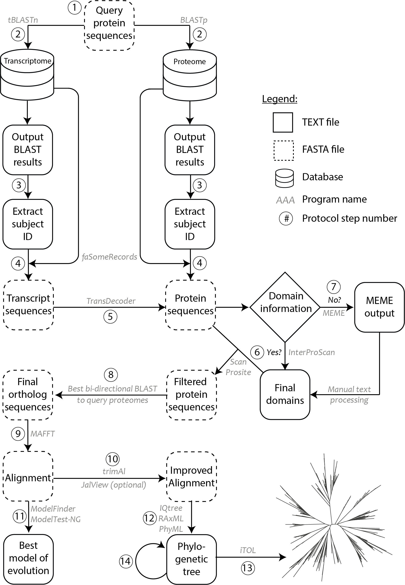

# Phylogenomics

All the data and scripts concerning phylogenetic tree construction from OneKP and MMETSP datasets ara availbale in this repository. 
The method has been developed and tested with multiple gene families in land plants:

Sumanth K Mutte, Hirotaka Kato, Carl Rothfels, Michael Melkonian, Gane Ka-Shu Wong, Dolf Weijers. 
Origin and evolution of the nuclear auxin response system. eLife 2018;7:e33399 DOI: [10.7554/eLife.33399](https://doi.org/10.7554/eLife.33399).

A detailed version of the protocol can be found in the Bio-protocol [here](https://bio-protocol.org/e3566).

`InterproscanSummary.py` takes in the tsv format from InterProScan results.
\
`fasta2relaxedPhylip` that was used in the protocol is from: https://github.com/npchar/Phylogenomic
